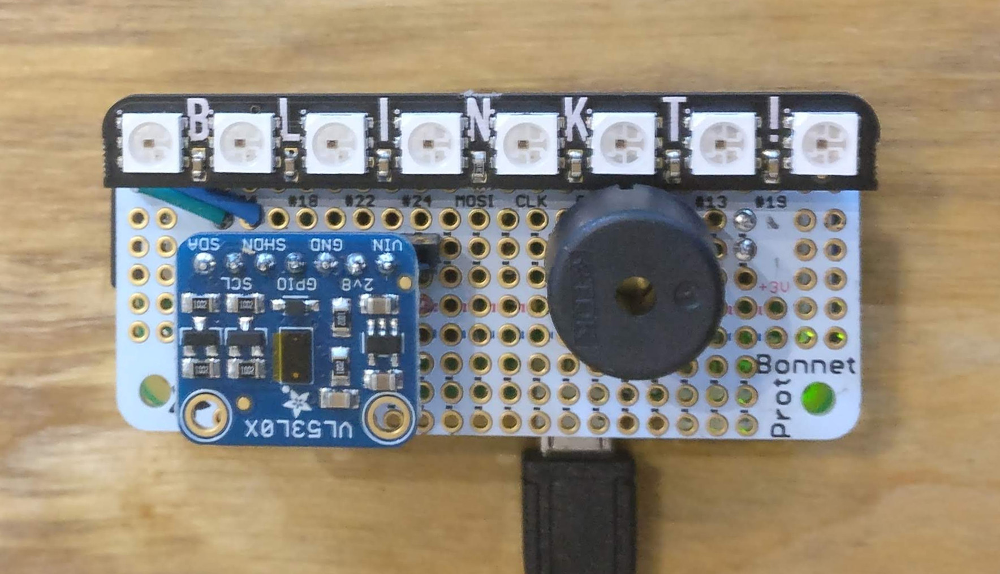
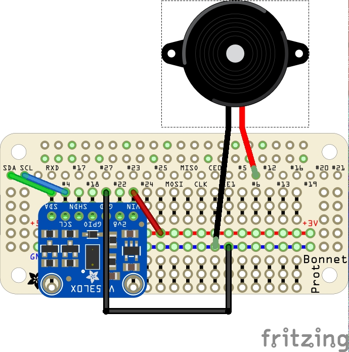

# Lazydoro

A Pomodoro timer for lazy developers like me.

## How you use it

Lazydoro uses a Time-of-Flight (ToF) sensor to detect your presence.

When you sit down to work, lazydoro starts a [Pomodoro](https://en.wikipedia.org/wiki/Pomodoro_Technique) timer.

This runs for 25 minutes; at the end of that time it will beep to tell you that you should take a break. (If you stop early that Pomodoro session will be cancelled.)

When you get up and leave your desk it will start a 5 minute break timer. At the end of your 5 minute break it will beep to tell you to resume work.

The version shown use a Raspberry Pi zero. It uses Pimoroni's Blinkt LED array to show if you are working or resting, and to give feedback about hom much time has expired.

So long as you are happy with Python classes and objects the code is simple and easy to modify. At some stage I may add a ZeroMQ interface that will allow another application to keep track of Pomodoro events.

The hardware and software have gone through several iterations. I plan to write a history page which will describe project's evolution.

## Hardware

### Bill of Materials

The timer requires the following components. Most links are for the Pimoroni shop, as that's where I got the components I used. Other sources are available.

|Hardware|Comment|URL|
|--------|-----------|---|
|Raspberry Pi Zero/Zero W/WH|Needs male header|[buy here](https://shop.pimoroni.com/products/raspberry-pi-zero-wh-with-pre-soldered-header)|
|microSD card|this has NOOBS installed, but you can overwrite it|[buy here](https://shop.pimoroni.com/products/noobs-32gb-microsd-card-3-1)|
|Adafruit permaProto bonnet|Needs a stacking female header - see below|[buy here](https://shop.pimoroni.com/products/adafruit-perma-proto-bonnet-mini-kit)|
|Stacking header|With 11 mm pins|[buy here](https://shop.pimoroni.com/products/2x20-pin-gpio-header-for-raspberry-pi-2-b-a?variant=1132812269)|
|Adafruit VL53L0X ToF sensor|Comes with header, needs soldering|[buy here](https://shop.pimoroni.com/products/adafruit-vl53l0x-time-of-flight-distance-sensor-30-to-1000mm)|
|Blinkt!|Plugs onto the extended header pins|[buy here](https://shop.pimoroni.com/products/blinkt)|
|Piezo buzzer|Any 3v capable *externally* driven buzzer|Shop around!|

### Wiring it up

Here's a fritzing diagram which shows the connections and approximate physical layout.

### Installing the software

You'll need to know how to set up and connect to a Raspberry Pi zero. If you don't yet, you'll find great advice on the official Raspberry Pi site. For this project you'll need  the current (buster) version of Rasbpian. The lite version is fine, though fuller versions are also OK. 

###

At some point I will put this up on PyPi.

For now, you'll need to clone this repository into the directory of your choice on the Pi zero, change directory, extend your PYTHONPATH, and run the software using Python3.

    git clone 

